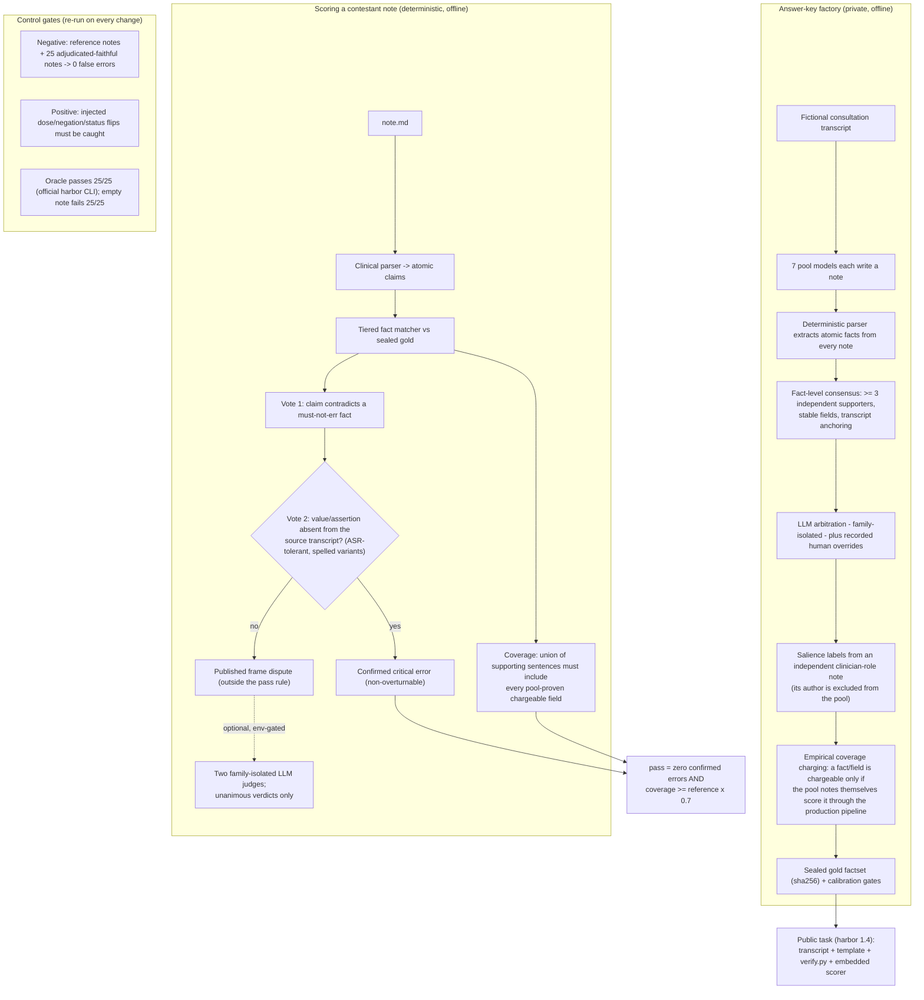

# FactBench — factual-consistency benchmark for clinical note generation

*Protocol `detfact-v2.1` · fully synthetic public track · harbor-style task layout*

**Live leaderboard:** https://newdogwang-netizen.github.io/factbench-public/

FactBench measures whether an LLM/agent can turn a (fictional) doctor–patient
consultation transcript into a **factually consistent** clinical note. Scoring is
**deterministic** — a rule-based clinical parser plus a tiered fact matcher — so every
verdict is reproducible and auditable down to the transcript quote.

## Why another benchmark

An AI scribe listens to a doctor–patient conversation and writes the clinical
note. The dangerous failures are quiet: a dose written as 50 mg instead of
100 mg, a stopped medication written as current, an order that was never
given. FactBench measures exactly one thing: **does the note stay faithful to
what was actually said?**

Most existing evals grade notes with a stronger LLM ("the judge"). That has
three problems this benchmark is built to avoid:

1. **The judge is noisy on exactly the details that matter.** LLMs misread
   doses, tenses and negations — the same failure modes they are supposed to
   grade.
2. **The score is not reproducible.** Change the judge model, its prompt, or
   the temperature, and the number moves. You cannot tell "the model
   improved" from "the judge changed".
3. **The score is not auditable.** A judge returns a number and a paragraph.
   When a vendor disputes a penalty, there is nothing to appeal against.

FactBench takes the opposite architecture:

- **Scoring is code, not opinion.** A rule-based clinical parser extracts
  atomic claims from the note; a deterministic matcher compares them to a
  sealed answer key. Zero network, zero LLM calls at scoring time —
  re-running produces byte-identical results.
- **Every penalty is a case file.** A flagged sentence points to the exact
  answer-key fact it contradicts, the 6–8 independent note sentences that
  established that fact, and the transcript anchor behind it. Anyone can
  re-try the verdict against the source.
- **A "critical error" cannot be argued away.** It only counts when the note
  states something (say, a dose) that appears *nowhere* in the source
  conversation — checked automatically, spelled-number variants included. If
  the value does appear (an old dose, a titration step), the flag is
  downgraded to a published **dispute** instead of a penalty. So a confirmed
  error is non-overturnable by construction: overturning it would require
  finding the value in the source, and then it would never have been
  confirmed.
- **The instrument itself is under test.** Every change to the scorer must
  re-pass two control gates: reference notes and a sealed corpus of
  hand-verified faithful sentences must score **zero** false errors
  (false-positive floor), and a battery of injected errors — dose flips,
  negation removals, status flips — must still be caught (sensitivity
  floor). An LLM judge can publish neither number.
- **LLMs appear in exactly one place**: an optional appeals lane where two
  judges from families unrelated to the contestants re-read the small,
  published dispute list. They can re-label a dispute; they can never add or
  remove a single point of score.

Everything needed to disagree with us ships in this repo: the sealed answer
keys with per-fact provenance, the scorer source, the control gates
(`make check`, `make mutation-check`), and the design history
([`docs/DESIGN.md`](docs/DESIGN.md)). See the [FAQ](#faq) for the questions
this design gets asked most.

## Related work — why this slot was empty

Existing healthcare evals measure something adjacent, not this:

- **Medical-knowledge QA** (MedQA, MMLU-Med, and successors) tests what a
  model *knows*, not whether it stays factual when transcribing a specific
  patient's consultation.
- **Physician-rubric conversation evals** (e.g. HealthBench-style) grade
  open-ended clinical dialogue with LLM/rubric judges — valuable for
  bedside-manner-and-safety breadth, but the grading is judge-dependent and
  not auditable at the level of "this dose contradicts this sentence".
- **Dialogue-to-note datasets** (ACI-Bench, MTS-Dialog, MEDIQA tasks) are the
  closest task-wise, but score with n-gram/embedding overlap (ROUGE,
  BERTScore) or LLM judges — a note can fabricate a dose and still score
  well on overlap, or be graded differently when the judge model changes.

To our knowledge there is no public, deterministic, sentence-appealable
leaderboard for **factual consistency of generated clinical notes**. That is
the slot FactBench fills: fact-level scoring where every conviction is
confirmed against the source transcript and every rule has a published
control gate. (If we missed a comparable effort, open an issue — the
comparison table has room.)

## Architecture

Three planes: a **private answer-key factory** builds and seals the tasks; the
**public repo** ships tasks + scorer + gates; **scoring** is deterministic with
one optional, bounded LLM lane.



The same instrument runs on three datasets: the public **synthetic v2.2**
tasks, a **de-identified real** track (models see de-identified transcripts;
scoring stays private against the sealed real answer key; aggregates
published), and a **private real** track (in-pool models, validity findings
only). The leaderboard leads with the cross-dataset comparison because that
gap — every model drops 14–30 points on real audio — is the headline finding.

## How gold is built (note-consensus v2)

The transcript is never mined directly (ASR noise poisons facts). Instead:

1. 7 independent models each write a note from the same transcript;
2. one deterministic parser extracts atomic facts from each note (**the same parser
   scores contestants** — extraction bias cancels by symmetry);
3. facts enter gold only with **≥3 independent supporters** and no stable-field
   disagreement (a high-precision consensus subset — *not* unanimous-only gold;
   unanimity would starve gold, since generators are selective about what they write);
   weak fields need a supporting quote; every fact must anchor back to the transcript
   (fuzzy, ASR-tolerant);
4. an arbitration loop refines the set (LLM arbiter from a model family isolated from
   all generators; recorded human-override decisions take precedence). **Review
   status**: public factsets are marked `reviewed: false` — LLM-arbitrated with human
   overrides applied, but the systematic human spot-check for this synthetic track is
   still pending. Treat gold as high-precision but challengeable (see CONTRIBUTING);
5. importance is separated from existence: **must-cover** labels come from an
   independent reference note (its author model is excluded from the consensus pool).

## Scoring semantics (what the numbers mean)

Two independent axes, never blended:

- **Coverage** — of the must-cover facts, how many the note earns credit for.
  Charging is *empirically derived*: a fact charges only if ≥3 of the pool's
  own notes score it through this exact pipeline, and only for the fields a
  majority of those notes carried (`salience.cover_fields` / `cover_probe`).
  Naming a drug without its dose earns nothing where the pool wrote doses.
- **Critical errors** — confirmed dangerous mistakes under the *two-vote
  rule*: the claim must contradict a must-not-err gold fact **and** be
  deterministically confirmed against the source transcript (a dose that
  appears nowhere near the drug, etc.). Unconfirmed candidates surface as
  **`frame_disputes`** — published, outside the pass rule, optionally
  re-examined by a dual-judge LLM lane (unanimous verdicts only,
  `adjudicated_crit`).
- **Pass** per task = `critical_wrong == 0 AND coverage ≥ MIN_COVERAGE`
  (reference coverage × 0.7, capped at 0.5).

Full rationale with the audits that forced each rule: [`docs/DESIGN.md`](docs/DESIGN.md);
mechanics: [`PROTOCOL.md`](PROTOCOL.md).

## Task layout (harbor-style)

```
tasks/<case>/
├── task.toml            # metadata, provenance, pass rule
├── environment/         # agent input: transcript + template + instruction
├── solution/note.md     # oracle (reference note; guaranteed critical_wrong == 0)
└── tests/verify.py      # deterministic verifier + sealed gold factset
```

An empty/no-op note fails (coverage 0); the oracle passes; mutation classes from the
positive-control card double as cheat-trials.

## Known limits (published, not hidden)

**Why the rules are shaped this way** — pass-bar calibration, empirically
derived coverage, the two-vote critical channel, and why the score is produced by a
deterministic scorer with LLMs confined to an appeals lane (vs. direct
LLM-judge grading) — is documented in [`docs/DESIGN.md`](docs/DESIGN.md).

See `PROTOCOL.md` (Known limits): narrative-tense residuals, weak primary-channel
recall on whole-drug-swap and plan-fabrication (covered by fabrication alarms and
coverage-drop channels), specialty domain gate (out-of-domain cases are excluded
explicitly, never silently blended).

## Data provenance & privacy

**All public tasks are fully synthetic** — fictional patients, clinicians, and events,
generated for this benchmark. No real patient data is present in this repository. The
export tool physically refuses to package non-synthetic cases.

**Validity scope (honest):** per-task scoring is deterministic, oracle-verified
(official harness: 25/25 oracle reward = 1.0) and mutation-tested (dose-flip cheat
trials are caught). However, an internal real-transcript track (never published)
shows that cross-model *rankings* on this synthetic track do **not** transfer to
real ASR-transcript performance (Spearman 0.46; an author-rotation experiment ruled
out stylistic bias — the tracks measure different capability axes: clean-dialogue
note-writing here vs. noisy-ASR note-writing internally). Treat scores as measuring
exactly what the tasks contain. Difficulty tiers are in task metadata; noisier
ASR-like transcript recipes are on the roadmap.


## Results

The live leaderboard (all published runs, deterministic + dual-judge
adjudicated, 8 languages) is at
**https://newdogwang-netizen.github.io/factbench-public/**. Gold-pool models'
own scores are annotated on the board where applicable — in-pool models carry
a structural familiarity advantage, so read same-family rows with the notes
column.

## How to run

Five ways, from lightest to most standardized:

**1. Any OpenAI-compatible API (no install)** — see Quickstart below. One script,
stdlib-only, works with OpenAI / Azure / vLLM / Ollama / any `/chat/completions`
endpoint.

**2. Official harbor harness** — `pip install harbor`, then:

```bash
harbor run -p tasks -a <agent>     # e.g. claude-code, codex, ... (agent's own API key required)
harbor run -p tasks -a oracle      # sanity: reference solutions, expect 25/25 reward 1.0
```

harbor builds each task's environment image (agent sees only transcript + template,
no network, no gold), collects `note.md`, then runs the deterministic verifier and
writes per-trial rewards.

**3. Score-only** — you already generated notes with your own harness:

```bash
python3 scripts/run_api_model.py --notes-dir /path/to/notes --label my-model
# expects <notes-dir>/<task_id>/note.md (or <task_id>.md); no API calls
```

**4. Scoring service (Docker)** — for product/CI integration:

```bash
docker build -f service/Dockerfile -t factbench-service .
docker run -p 8830:8830 factbench-service
curl -X POST localhost:8830/score -d '{"task_id":"case_s001_syn","note":"..."}'
```

**5. Custom agent / manual** — for your own harness:

```bash
cd tasks/<case>
# give your agent environment/transcript.txt + environment/template.txt
# it must write note.md into some working directory, then:
cd <workdir> && python3 /path/to/tasks/<case>/tests/verify.py
# prints JSON metrics; exit 0 = pass (critical_wrong == 0 and coverage >= MIN_COVERAGE)
```

Scoring never calls an LLM — results are bit-for-bit reproducible. To validate the
task set itself (oracle passes, empty note fails): `python3 scripts/check_tasks.py`.

## Quickstart: score any OpenAI-compatible API

No agent harness required — the runner speaks plain `/chat/completions`:

```bash
OPENAI_BASE_URL=https://api.example.com/v1 \
OPENAI_API_KEY=sk-... \
MODEL=your-model-name \
python3 scripts/run_api_model.py
```

Per-task results and `results/<model>/summary.json` (pass rate, mean coverage,
critical-error count, case-level bootstrap CI, safety flags) are produced locally;
scoring is fully deterministic and offline. Outputs missing the required
`<final_generated_text>` tags are recorded as `invalid`/`salvaged` generations —
raw chain-of-thought is never silently scored. The runner uses the benchmark's canonical generation protocol (same
system prompt and output tags as the reference notes) so comparisons are fair.
Alternatively, run through the official harbor harness: `harbor run -p tasks -a <agent>`.

## Results site

Published runs are shown on a GitHub Pages leaderboard at
https://newdogwang-netizen.github.io/factbench-public/ (GitHub Pages, branch
`master`, folder `/docs`). Publishing a run is
one command + one commit:

```bash
python3 scripts/publish_result.py results/<model>/summary.json --label "Model Name"
```

## Dataset manifest

`manifest.json` is a dataset-style release manifest (task list, per-file sha256,
difficulty tiers, pass rules, provenance, review status) for research pipelines,
leaderboards, and third-party eval frameworks. Rebuild with
`python3 scripts/build_manifest.py`; `CITATION.cff` has the citation entry.

## FAQ

**Q: Isn't a rule-based parser too brittle for clinical language?**
The parser's misreadings are real but contained by architecture: a parser
mistake can lose coverage (measurable, symmetric — the same parser built the
answer key from the pool notes, so extraction bias largely cancels) but it
cannot convict anyone by itself. A critical error additionally requires the
claimed value to be absent from the source. When audits found parser-hostile
sentence shapes, each became a *linguistic-class* guard (never an instance
list), gated by the sensitivity battery before merging. Coverage charges only
what the pool's own notes proved the pipeline can score — so nobody is ever
graded on something the sensor cannot see.

**Q: You still use LLMs (answer-key arbitration, the appeals lane). How is
that different from an LLM judge?**
Position, not presence. LLMs are used where judgment is genuinely needed —
building the answer key by multi-model consensus, and re-reading a small
published list of ambiguous sentences — and are structurally barred from the
part that produces the number. A judge in the appeals lane answers one atomic
question ("is this sentence supported by these excerpts?"), needs a unanimous
partner verdict, and can only re-label a dispute that was already public.

**Q: What stops a model from gaming the benchmark?**
The attacks we actually ran, and what happened: *name-dropping* (listing
drugs without doses) earns nothing, because a fact only pays out when the
fields most pool authors wrote are present; *transcript stuffing* (pasting
the dialogue as bullets) parses to almost nothing and fails the pass bar;
*dose flips* are caught by the mutation gate (and the gate itself verifies
each injection is parser-visible before counting it); training on the public
set is detectable via the held-out track (see EVALUATORS.md).

**Q: Why is the pass bar relative instead of a fixed percentage?**
Consultations differ in how writable they are. Each task's bar is 70% of what
an independent clinician-role note achieved on that same transcript (capped
at 50%), so the bar tracks true difficulty, is identical for every
contestant, and the shipped reference solution passes by construction —
which is what keeps the official harness green (oracle 25/25).

**Q: Why do you publish "disputes" instead of just counting them as errors?**
Because we hand-adjudicated over sixty raw flags against their sources and
almost all were faithful history colliding with a current-state answer key
("was on 10 mg before the increase"). Counting those as errors punishes
exactly the models that document history properly. Disputes stay visible —
nothing is hidden — but only source-confirmed contradictions score.

**Q: How do I know the answer key itself is right?**
Every fact carries its provenance: supporter count, the verbatim sentences of
the independent notes that established it, a transcript anchor, arbitration
and any human-override decisions. Facts only charge coverage if the pool
notes themselves can score them. And the key is challengeable: one published
verdict was reversed after re-audit (a spoken "one fifty" that a digit-only
search had missed) — the appeals discipline applies to our own rulings too.

**Q: Scores dropped when you changed the metric. Doesn't that make the
numbers meaningless?**
Metric versions are explicit (protocol id, benchmark version, manifest sha in
every published entry), old entries are retired rather than silently mixed,
and every metric change shipped with an A/B accounting showing absolute
detection counts were preserved. Rankings have been stable across regimes;
absolute numbers are only comparable within a version.

**Q: Why don't synthetic rankings match the real-audio rankings?**
They measure different capability axes: writing from clean scripted dialogue
vs surviving noisy, disfluent, one-sided ASR. That non-transfer (visible in
the comparison chart, and Spearman ~0.46 in the internal study) is a finding,
not a bug — and the reason the benchmark keeps a real-transcript track at
all.

## License

Apache-2.0. See `LICENSE` and `NOTICE`.
